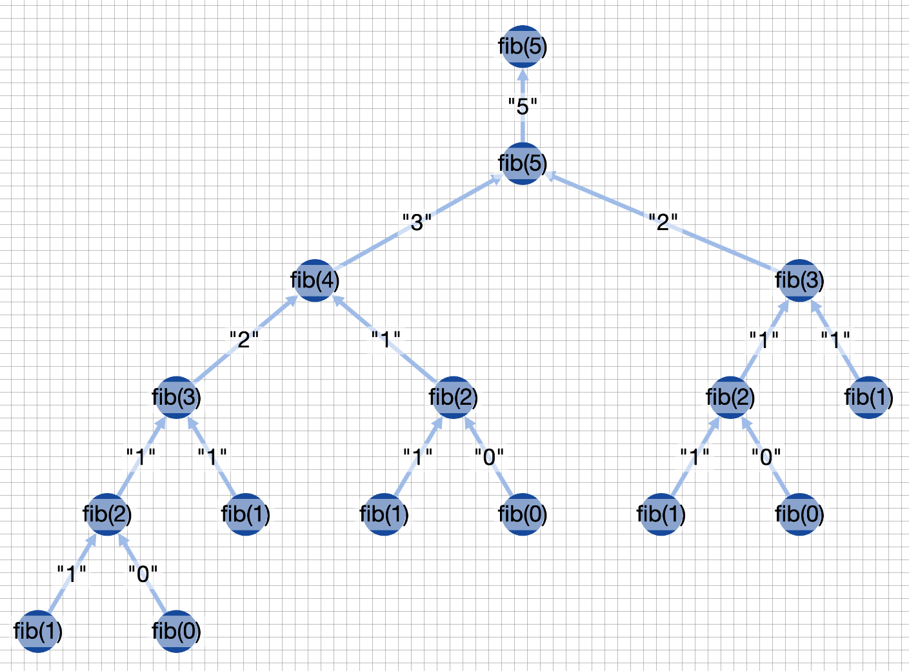

# Recursion Viewer

[Recursion Viewer Website](https://dmytrobaida.github.io/recursion-viewer/)

Monorepo containing website and VS Code extension for visualizing recursive function calls



## How to build and run projects

This project is built using NX for managing monorepo

-   To build some of project packages use (replace **project_name** with common, website or extension):

```bash
nx run project_name:build
```

-   You can also start dev server for website with:

```bash
nx run website:serve
```

To run extension there is a launch configuration for VS Code
