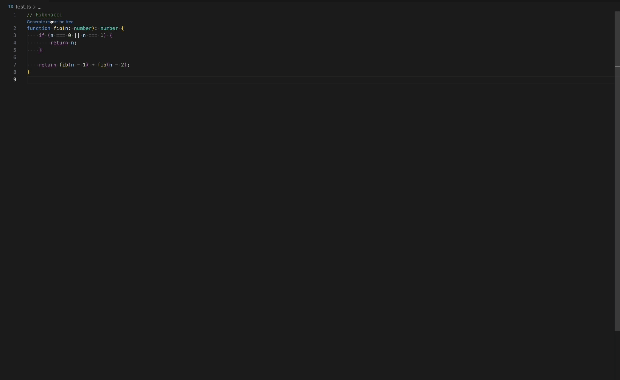

# Recursion Viewer VS Code extension

VS Code extension for visualizing recursive function calls. You can also visit website with this functionality - [Recursion Viewer](https://dmytrobaida.github.io/recursion-viewer/)

## Features

This VS Code extension helps to visualize recursion tree of any function written in JavaScript or TypeScript. It may help you to get better understanding how recursion works and debug you code if needed

## Requirements and supported languages

Currently supported languages:

-   TypeScript
-   JavaScript

## Release Notes

### 1.0.0

Initial release of Recursion Viewer
